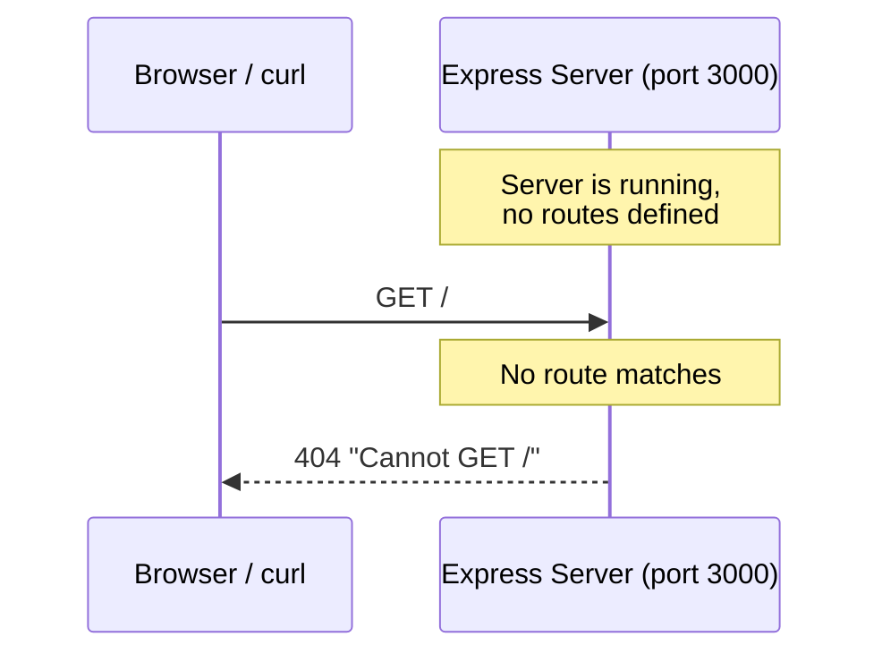
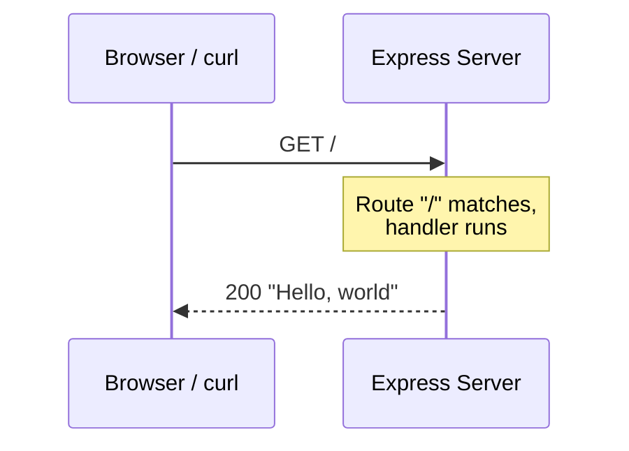

# Express.js Backend Learning Roadmap

> A step-by-step learning roadmap for building an Express.js backend from nothing to a basic production-grade server. Each step introduces exactly one new concept.

---

## SECTION 1 — Context (read this first)

### Goal

Build an Express.js backend in plain JavaScript, one very small step at a time. Each step introduces exactly one new concept — no leaps, no combining ideas. Learning comes from feeling the gap in each step and then filling it in the next step. The roadmap progresses from an empty folder to a basic production-aware backend.

### Fixed decisions

These are locked. Do not change them mid-roadmap.

1. **Language:** Plain JavaScript only. TypeScript is skipped entirely for this roadmap.
2. **Data storage (early steps):** In-memory JavaScript array inside the server process. A real database (SQLite) is introduced later as its own explicit step (Phase K).
3. **Resource modeled:** `tasks` — a simple to-do entity with fields `id`, `title`, `done`.
4. **Project structure (early steps):** Flat — everything in one file. Router/controller/service/repository layering is introduced later as explicit steps (Phase F), once the single file becomes unwieldy.
5. **Setup is interleaved with features.** Setup is not a one-time prerequisite. It grows with the app. Setup steps and feature steps are mixed in the order they become necessary.
6. **HTTP verbs:** All four (GET, POST, PUT, DELETE) must be covered at appropriate points in the roadmap.

### Five-part format for each step

Every detailed step has exactly these five parts, in this order:

1. **What we add in this step** — the one small change.
2. **What problem existed in the previous step** — the motivation. For Step 1, this is "nothing exists yet."
3. **How this step solves that problem** — the explanation.
4. **Mermaid sequence diagram** — showing the request/response flow. **Exception:** pure-setup steps with no running server or no HTTP flow skip the diagram. The step explicitly notes "no diagram for this step" and why.
5. **Theory only, no code.** Explanations describe what the code does, not the code itself.

### Full 56-step list (table of contents)

**Phase A — Get something running**
1. Create the project folder and run `npm init`
2. Install Express
3. Create a server that listens on a port (no routes yet, just a listener)
4. Add a single GET route at the root URL that returns a plain text message
5. Add a start script to `package.json`
6. Add nodemon so the server restarts on file changes

**Phase B — Read data**
7. Create an in-memory tasks array and add a GET route that returns it
8. Add a GET route that returns one task by id from the URL parameter

**Phase C — Accept data from the client**
9. Add the `express.json` middleware (first encounter with middleware as a concept)
10. Add a POST route that appends a new task to the array
11. Add a PUT route that replaces an existing task by id
12. Add a DELETE route that removes a task by id

**Phase D — Stop lying to the client**
13. Return 404 when GET by id cannot find the task
14. Return 404 when PUT cannot find the task
15. Return 404 when DELETE cannot find the task
16. Add a catch-all 404 handler for routes that do not exist
17. Add a centralized error-handling middleware
18. Deliberately throw a synchronous error in a route to see the middleware catch it
19. Deliberately throw an async error in a route to see it NOT get caught
20. Add an async handler wrapper so async errors reach the middleware

**Phase E — Stop trusting the client**
21. Add input validation for POST (required fields and types)
22. Add input validation for PUT
23. Trim whitespace from string fields in incoming bodies
24. Strip unknown fields from incoming bodies
25. Add a body size limit on `express.json`

**Phase F — Make the code navigable**
26. Move all routes into a separate router file
27. Move request/response handling into a controller file
28. Move business logic into a service file
29. Move the tasks array into its own data file
30. Wrap the data file access in repository functions

**Phase G — See what the server is doing**
31. Install pino and create a logger instance
32. Replace any existing `console.log` calls with the logger
33. Generate a unique request id for every incoming request and attach it to `req`
34. Create a child logger per request that includes the request id
35. Add a request logging middleware (method, path, status, duration)

**Phase H — Configuration**
36. Add dotenv and move the port into a `.env` file

**Phase I — Basic hardening**
37. Add helmet for security headers
38. Add CORS with an explicit allowed origin
39. Add rate limiting on all routes

**Phase J — Behave well in production**
40. Add a liveness health check endpoint
41. Add a readiness health check endpoint
42. Add graceful shutdown on SIGTERM and SIGINT
43. Separate operational errors from programmer errors in the error middleware
44. Add timeouts on the HTTP server

**Phase K — Real persistence**
45. Replace the in-memory array with SQLite
46. Add a schema migration step

**Phase L — Who is calling**
47. Add API key middleware on write routes
48. Upgrade the auth middleware from API key to JWT verification
49. Add role-based authorization on at least one route
50. Add `JWT_SECRET` to `.env` and validate all required env vars at startup

**Phase M — Prove it works**
51. Add Vitest as the test runner
52. Write a unit test for a service function
53. Write an integration test for a route using supertest

**Phase N — Ship it**
54. Add `/v1` prefix for API versioning
55. Enforce a consistent error response shape across all error responses
56. Add a Dockerfile

**Phase O — Future reference only (not part of this roadmap)**
Topics to learn after this roadmap is complete, listed so they are not forgotten: metrics (Prometheus client, RED method — request rate, error rate, duration), distributed tracing (OpenTelemetry), circuit breakers, retries with exponential backoff and jitter, idempotency keys for safe write retries, caching strategies (in-memory, Redis, HTTP cache headers), background job queues (BullMQ, RabbitMQ), and database transactions across multi-step writes. This phase is a reference, not a walkthrough.

### Current status

**Last completed step: 6** (end of Phase A)

**Next step to write: 7** (start of Phase B)

---

## SECTION 2 — Detailed steps

### Step 1 — Create the project folder and run `npm init`

**What we add in this step**
Create an empty folder for the project and run `npm init` inside it. This produces a `package.json` file.

**What problem existed in the previous step**
Nothing exists yet. There is no folder, no project, no way for Node.js to know that this directory is a JavaScript project, and no place to record which libraries the project depends on.

**How this step solves that problem**
`npm init` creates a `package.json` file. This file is the manifest of the project. It tells Node.js and npm that this directory is a JavaScript project. It will later hold the list of dependencies (libraries the project uses), scripts (commands like "start the server"), and metadata (project name, version). Without `package.json`, there is nowhere to install libraries into and nowhere to define commands. Every Node.js project starts here.

**Mermaid sequence diagram**
No diagram for this step. This is a pure setup step. There is no server running, no HTTP request, and no runtime flow to diagram. A sequence diagram of the developer typing a command into a terminal would not teach anything meaningful.

**Theory**
`package.json` is a plain JSON file. `npm init` asks a few questions (name, version, description, entry point, etc.) and writes the answers into the file. You can accept the defaults with `npm init -y` to skip the questions. The most important fields to understand at this stage are `name`, `version`, and `main` (the entry point file, usually `index.js`). The `dependencies` and `scripts` fields are empty now but will grow as the project grows. This is the first example of "setup is not a single thing" — `package.json` itself will change many times across this roadmap.

---

### Step 2 — Install Express

**What we add in this step**
Run `npm install express` inside the project folder. This downloads the Express library and records it as a dependency.

**What problem existed in the previous step**
After Step 1, there is a `package.json` file but no libraries installed. Node.js has built-in modules that can create an HTTP server (the `http` module), but using the built-in module directly is verbose and low-level — you have to manually parse URLs, handle methods, match routes, and write response headers for every request. For a learning roadmap about Express specifically, and for any real backend work, you need Express itself available in the project.

**How this step solves that problem**
`npm install express` does three things. First, it downloads the Express library (and all the libraries Express itself depends on) into a new folder called `node_modules`. Second, it records `express` in the `dependencies` section of `package.json`, so anyone else who clones the project can reinstall the same library. Third, it creates or updates a `package-lock.json` file, which pins the exact versions of every installed library for reproducibility. After this step, the project can `require('express')` and use it.

**Mermaid sequence diagram**
No diagram for this step. This is a pure setup step. The action is "npm downloads files from the npm registry to disk" — there is no request/response flow in the running server because the server does not exist yet.

**Theory**
`node_modules` is a folder that holds the actual code of every installed library. It can be very large and is never committed to version control — instead, `package.json` and `package-lock.json` are committed, and anyone can recreate `node_modules` by running `npm install`. Express is a library, not a framework in the heavy sense — it is a thin layer over Node.js's built-in `http` module that adds routing, middleware, and convenience methods for handling requests and responses. Understanding that Express sits on top of `http` is important later when you debug low-level issues like timeouts and connection handling.

---

### Step 3 — Create a server that listens on a port (no routes yet)

**What we add in this step**
Create a file (for example `index.js`) that imports Express, creates an Express application instance, and calls `.listen()` on a port (for example 3000). No routes are defined yet. Run the file with `node index.js`. The server starts and waits for connections.

**What problem existed in the previous step**
After Step 2, Express is installed but nothing uses it. There is no running process, no open port, nothing listening for HTTP requests. If you tried to visit `http://localhost:3000` in a browser, nothing would answer because no server is running.

**How this step solves that problem**
This step starts a real HTTP server. Calling `express()` creates an Express application object. Calling `.listen(port)` on that object does two things: it opens a TCP socket on the given port number and tells the operating system "I want to receive incoming connections on this port," and it starts Node.js's event loop waiting for those connections. From this moment on, the process stays alive, watching the port, ready to handle requests. However, because no routes are defined yet, any request that arrives will get a default Express response — typically a 404 "Cannot GET /" message. That is fine for this step. The point of this step is only to prove that the server is running and reachable, not to handle any specific request.

**Mermaid sequence diagram**

**Theory**
The port number (3000 in this example) is an arbitrary choice for development. Ports below 1024 require root privileges on Linux and Mac, which is why development servers commonly use 3000, 4000, 5000, 8000, or 8080. Only one process can listen on a given port at a time — if you see `EADDRINUSE`, another process already holds the port. The `.listen()` call is asynchronous but it does not block further code; it registers the listener with the event loop and returns. The process stays alive because the event loop has work to do (watching the socket). This is why you do not need an explicit "keep running" loop — Node.js stays running as long as there is at least one active handle, and an open listening socket is an active handle. Stopping the server means sending a signal to the process (Ctrl+C in the terminal sends SIGINT), which is something you will handle explicitly much later in Step 42 (graceful shutdown).

---

### Step 4 — Add a single GET route at the root URL

**What we add in this step**
Add one route handler: `app.get('/', (req, res) => { ... })` that sends a plain text response like "Hello, world" or "Server is running." Restart the server. Visiting `http://localhost:3000/` in a browser now shows the text instead of the default 404.

**What problem existed in the previous step**
After Step 3, the server was running but had no routes defined. Every incoming request was answered with Express's default "Cannot GET /" 404 response. The server was reachable but useless — it could not actually respond with anything meaningful. You could not tell from the response whether your server was working correctly or whether you were hitting a broken endpoint.

**How this step solves that problem**
`app.get('/', handler)` registers a function to run whenever a GET request arrives at the path `/`. When a request matches, Express calls the handler with two arguments: `req` (the request object, containing information about what the client sent) and `res` (the response object, used to send data back). Calling `res.send('Hello, world')` writes a response body, sets appropriate headers (like `Content-Type: text/html`), and ends the response. Now the server has one working endpoint. You can verify the server is alive and correctly configured by hitting this endpoint. This is the smallest possible "working" server — one route, one verb, one response.

**Mermaid sequence diagram**

**Theory**
`app.get(path, handler)` is one of several route-registration methods on the Express app object. There are equivalent methods for every HTTP verb: `app.post`, `app.put`, `app.delete`, `app.patch`, and so on. The handler function receives `req` and `res` and is responsible for ending the response by calling one of `res.send`, `res.json`, `res.end`, `res.sendFile`, or similar. If the handler does not end the response, the request hangs until the client times out — this is a common beginner bug. `res.send` is smart about content types: it sends strings as `text/html`, objects as `application/json`, and buffers as `application/octet-stream`. Later in the roadmap you will use `res.json` explicitly for clarity when returning JSON. The path `/` is the root; more complex paths like `/tasks` and `/tasks/:id` appear in Phase B.

---

### Step 5 — Add a start script to `package.json`

**What we add in this step**
Open `package.json` and add a `"start": "node index.js"` entry inside the `"scripts"` object. From now on, you run the server with `npm start` instead of `node index.js`.

**What problem existed in the previous step**
After Step 4, you run the server by typing `node index.js` in the terminal. This works but has problems. First, the command depends on knowing the name of the entry file — if a new person joins the project, they have to guess or ask. Second, as the project grows, the start command may need extra flags (environment variables, inspector flags, etc.), and those would have to be remembered every time. Third, there is no standard convention — different projects would use different commands, making it harder to move between codebases.

**How this step solves that problem**
The `scripts` section of `package.json` is a named list of commands. Once you define `"start": "node index.js"`, anyone (including tools like Docker and deployment platforms) can run `npm start` without knowing what the actual command is underneath. `npm start` is a conventional name — nearly every Node.js project uses it to mean "run the server in whatever way this project expects." This abstraction lets the actual command evolve without breaking anyone's workflow. If tomorrow you need to add an environment variable prefix or switch the entry file name, you change the script definition once and everyone keeps typing `npm start`.

**Mermaid sequence diagram**
No diagram for this step. This is a pure setup step. The change is a configuration entry in `package.json` that affects how the developer starts the server, not how the server handles requests. The request/response flow is identical to Step 4.

**Theory**
npm has a few "well-known" script names that can be run without the `run` keyword: `start`, `test`, `stop`, `restart`. For custom script names, you use `npm run <name>`. For example, later you will add a `"dev"` script for nodemon, and you will run it with `npm run dev`. The scripts field is essentially a mini task runner — anything you can type in a shell, you can put here. Common scripts in mature projects include `start`, `dev`, `build`, `test`, `lint`, `format`, and `migrate`. Keeping these consistent across projects is valuable because it reduces cognitive load when switching between codebases.

---

### Step 6 — Add nodemon so the server restarts on file changes

**What we add in this step**
Install nodemon as a development dependency with `npm install --save-dev nodemon`. Add a new script to `package.json`: `"dev": "nodemon index.js"`. From now on, during development, you run `npm run dev` instead of `npm start`. When you save a file, the server automatically stops and restarts with the new code.

**What problem existed in the previous step**
After Step 5, every time you change a line of code, you have to manually stop the server (Ctrl+C) and start it again (`npm start`). This is slow and breaks flow. For a roadmap where you will make many small changes and test each one, manual restart becomes painful quickly. Worse, it is easy to forget to restart — you change the code, test the endpoint, and get confused because the old code is still running.

**How this step solves that problem**
nodemon is a development tool that watches the files in your project folder. When any file changes (save, create, delete), nodemon kills the current Node.js process and starts a new one automatically. The effect is that your code changes take effect immediately without manual intervention. It is installed as a `devDependency` (with `--save-dev`) because it is only needed during development — in production you run `npm start` with plain `node`, not nodemon. Keeping `start` and `dev` as separate scripts reflects this: `start` is for production, `dev` is for local development.

**Mermaid sequence diagram**
No diagram for this step. This is a pure setup step. nodemon affects the developer's workflow (automatic restarts) but does not change how the server handles HTTP requests. The request/response flow is identical to Step 4.

**Theory**
The distinction between `dependencies` and `devDependencies` in `package.json` matters. `dependencies` are libraries the application needs to actually run in production — Express is one. `devDependencies` are libraries needed only during development or build — nodemon, testing libraries (Vitest in Step 51), and linters. When deploying to production with `npm install --production`, devDependencies are skipped, keeping the production install smaller and the attack surface smaller. nodemon watches files using the operating system's file-watching APIs (inotify on Linux, FSEvents on Mac, ReadDirectoryChangesW on Windows); it is not polling. The restart is a full process restart — in-memory state is lost on every restart, which is exactly why the tasks array will reset every time you save a file in later steps. This is a feature for learning (clean slate every restart) but would be a problem in production, which is why Phase K introduces a real database.

---

## SECTION 3 — Resume instructions (for the next Claude in the next chat)

**If you are a Claude instance reading this file in a new chat, read this section carefully.**

### What this file is

This is a learning roadmap being built incrementally across multiple chat sessions. The user is learning Express.js by working through small steps. Each step follows a strict five-part format. The file is the handoff document between chat sessions — it carries all the context needed to continue the work without the user having to re-explain anything.

### What you must do

1. **Read Section 1 completely.** It contains the goal, the fixed decisions (these are locked — do not change them or suggest changing them), the five-part format specification, and the full 56-step list.

2. **Read Section 2 completely.** This shows you the established writing style, tone, depth of explanation, and diagram style. Match it exactly. Do not invent a new format. Do not add or remove parts from the five-part structure.

3. **Check the "Current status" line in Section 1.** It says "Last completed step: X". The next step to write is X+1.

4. **Write the next chunk of steps** in the same five-part format, appending them to Section 2 in order. A reasonable chunk is one full phase, or 5–8 steps, whichever is smaller. Do not try to write all remaining steps in one response — you will run out of response length.

5. **Update the "Current status" line** in Section 1 to reflect the new last-completed step and the new next-step.

6. **Return the updated file to the user** using the file creation tool, so they can download it.

### Format rules you must follow

- **Five parts per step, in this order:** (1) What we add, (2) What problem existed in the previous step, (3) How this step solves that problem, (4) Mermaid sequence diagram, (5) Theory.
- **Pure-setup steps skip the diagram.** Write "No diagram for this step" and explain in one sentence why (no running server, no HTTP flow, etc.). Do not invent diagrams for setup steps just to fill the slot.
- **Theory only, no code.** Describe what the code does, not the code itself. No code snippets anywhere in the steps. If you catch yourself writing `app.get(...)` with actual syntax beyond a short inline mention of a method name, stop and rewrite.
- **Plain JavaScript only.** Never mention TypeScript as an option. It is explicitly out of scope.
- **Each step is one small change.** If a step feels like two changes, that is a sign the step list is wrong — stop and flag it to the user instead of silently merging or splitting.
- **Build on previous steps.** Each "problem in the previous step" section must actually reference what was done in the previous step, not a generic problem.
- **Match the tone.** Technical, direct, no filler, no motivational language, no emojis. The user has stated preferences for precise wording and rigorous explanations.

### What not to do

- Do not rewrite Section 1. It is locked.
- Do not rewrite previously completed steps in Section 2. They are locked.
- Do not skip steps or reorder them. The list in Section 1 is the authoritative order.
- Do not add new steps that are not in the list without asking the user first.
- Do not change the fixed decisions (JavaScript only, in-memory tasks, flat first, etc.).
- Do not ask the user clarifying questions that are already answered in Section 1. Read it first.

### How the user will prompt you

The user will likely say something short like "continue the roadmap" or "write next phase" or "continue from step X". That is enough. The file is the context. You do not need more information to continue.

### When the roadmap is complete

When Step 56 is written, update the "Current status" line to "Roadmap complete. All 56 steps written." Then add a short closing note at the end of Section 2 reminding the user that Phase O (Tier 3 topics) is listed in Section 1 as future reference and is intentionally not walked through in detail.
