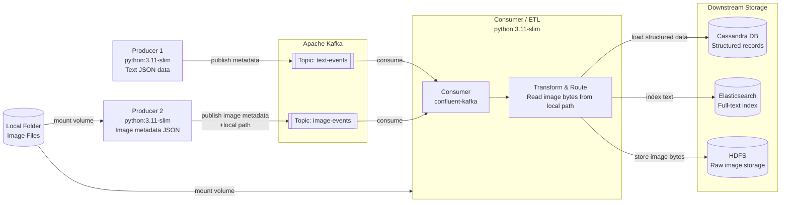

# Kafka ETL Pipeline — Project Context & Execution Roadmap

> **Cross-chat continuation document.**
> At the start of a new chat, paste this file and say: "Continue from where we left off using this context document."

---

## 1. Project Overview

**Purpose:**
ETL pipeline that ingests two data types — text from internet and images from local folder — through Apache Kafka as the message bus, then routes and loads each data type into the appropriate downstream storage system.

**Architecture summary:**
- Two producers publish to two separate Kafka topics
- One consumer reads from both topics, transforms, and routes data
- Three downstream storage systems handle different data types
- Local folder mounted as Docker volume into Producer 2 and Consumer

---

## 2. Architecture Diagram (Mermaid)



---

## 3. System Requirements (Windows Local)

| Item | Requirement |
|---|---|
| OS | Windows 10/11 |
| Docker Desktop | Latest stable, WSL2 backend enabled |
| WSL2 | Enabled and set as default |
| RAM | Minimum 16 GB recommended (Kafka + Cassandra + ES + HDFS together are heavy) |
| Disk | Minimum 40 GB free |
| CPU | 4 cores minimum |

---

## 4. Docker Image Versions

| Service | Image | Tag |
|---|---|---|
| Zookeeper | confluentinc/cp-zookeeper | 7.6.0 |
| Kafka Broker | confluentinc/cp-kafka | 7.6.0 |
| Producer 1 | python | 3.11-slim |
| Producer 2 | python | 3.11-slim |
| Consumer / ETL | python | 3.11-slim |
| Cassandra | cassandra | 4.1 |
| Elasticsearch | elasticsearch | 8.13.0 |
| HDFS Namenode | bde2020/hadoop-namenode | 2.0.0-hadoop3.2.1-java8 |
| HDFS Datanode | bde2020/hadoop-datanode | 2.0.0-hadoop3.2.1-java8 |

---

## 5. Docker Network Plan

| Item | Value |
|---|---|
| Network name | `etl-network` |
| Network driver | bridge |

| Container | Container Name | Port Mapping |
|---|---|---|
| Zookeeper | `zookeeper` | 2181:2181 |
| Kafka Broker | `kafka` | 9092:9092 |
| Producer 1 | `producer1` | — |
| Producer 2 | `producer2` | — |
| Consumer / ETL | `etl-consumer` | — |
| Cassandra | `cassandra` | 9042:9042 |
| Elasticsearch | `elasticsearch` | 9200:9200 |
| HDFS Namenode | `namenode` | 9870:9870, 8020:8020 |
| HDFS Datanode | `datanode` | 9864:9864 |

---

## 6. Volume Mount Plan

| Container | Local Path (Windows) | Container Path |
|---|---|---|
| Producer 2 | `C:\etl-pipeline\images` | `/data/images` |
| Consumer / ETL | `C:\etl-pipeline\images` | `/data/images` |

---

## 7. Environment Variables Reference

| Variable | Value | Used By |
|---|---|---|
| `KAFKA_BROKER` | `kafka:9092` | Producer 1, Producer 2, Consumer |
| `ZOOKEEPER_URL` | `zookeeper:2181` | Kafka broker |
| `TEXT_TOPIC` | `text-events` | Producer 1, Consumer |
| `IMAGE_TOPIC` | `image-events` | Producer 2, Consumer |
| `CASSANDRA_HOST` | `cassandra` | Consumer |
| `CASSANDRA_PORT` | `9042` | Consumer |
| `CASSANDRA_KEYSPACE` | `etl_pipeline` | Consumer |
| `ES_HOST` | `http://elasticsearch:9200` | Consumer |
| `HDFS_NAMENODE` | `hdfs://namenode:8020` | Consumer |
| `IMAGE_LOCAL_PATH` | `/data/images` | Producer 2, Consumer |

---

## 8. Project Folder Structure

```
C:\etl-pipeline\
│
├── images\                  ← local image files (mounted as volume)
│
├── producer1\
│   ├── producer1.py
│   ├── requirements.txt
│   └── Dockerfile
│
├── producer2\
│   ├── producer2.py
│   ├── requirements.txt
│   └── Dockerfile
│
└── consumer\
    ├── consumer.py
    ├── requirements.txt
    └── Dockerfile
```

---

## 9. Execution Phases & Steps

### Phase 1 — Kafka Infrastructure

- [ ] Step 1.1: Run Zookeeper container
- [ ] Step 1.2: Verify Zookeeper is healthy
- [ ] Step 1.3: Run Kafka broker container
- [ ] Step 1.4: Verify Kafka broker is healthy
- [ ] Step 1.5: Create `text-events` topic
- [ ] Step 1.6: Verify `text-events` topic exists
- [ ] Step 1.7: Create `image-events` topic
- [ ] Step 1.8: Verify `image-events` topic exists

### Phase 2 — Producer 1 (Text JSON)

- [ ] Step 2.1: Create project folder structure
- [ ] Step 2.2: Write `producer1.py`
- [ ] Step 2.3: Write `requirements.txt`
- [ ] Step 2.4: Write `Dockerfile`
- [ ] Step 2.5: Build Docker image
- [ ] Step 2.6: Run Producer 1 container
- [ ] Step 2.7: Verify messages arriving in `text-events` topic

### Phase 3 — Producer 2 (Image Metadata)

- [ ] Step 3.1: Create project folder structure
- [ ] Step 3.2: Write `producer2.py`
- [ ] Step 3.3: Write `requirements.txt`
- [ ] Step 3.4: Write `Dockerfile`
- [ ] Step 3.5: Build Docker image
- [ ] Step 3.6: Run Producer 2 container with volume mount
- [ ] Step 3.7: Verify messages arriving in `image-events` topic

### Phase 4 — Cassandra

- [ ] Step 4.1: Run Cassandra container
- [ ] Step 4.2: Verify Cassandra is healthy
- [ ] Step 4.3: Create keyspace
- [ ] Step 4.4: Create table schema for structured records
- [ ] Step 4.5: Verify keyspace and table exist

### Phase 5 — Elasticsearch

- [ ] Step 5.1: Run Elasticsearch container
- [ ] Step 5.2: Verify Elasticsearch is healthy
- [ ] Step 5.3: Create index for text data
- [ ] Step 5.4: Verify index exists

### Phase 6 — HDFS

- [ ] Step 6.1: Run HDFS Namenode container
- [ ] Step 6.2: Run HDFS Datanode container
- [ ] Step 6.3: Verify HDFS cluster is healthy
- [ ] Step 6.4: Create directory for image storage
- [ ] Step 6.5: Verify directory exists

### Phase 7 — Consumer / ETL

- [ ] Step 7.1: Create project folder structure
- [ ] Step 7.2: Write `consumer.py` — Kafka consume logic
- [ ] Step 7.3: Write transform and route logic — text → Cassandra
- [ ] Step 7.4: Write transform and route logic — text → Elasticsearch
- [ ] Step 7.5: Write transform and route logic — image bytes → HDFS
- [ ] Step 7.6: Write `requirements.txt`
- [ ] Step 7.7: Write `Dockerfile`
- [ ] Step 7.8: Build Docker image
- [ ] Step 7.9: Run Consumer container with volume mount
- [ ] Step 7.10: Verify records in Cassandra
- [ ] Step 7.11: Verify records in Elasticsearch
- [ ] Step 7.12: Verify image files in HDFS

### Phase 8 — End to End Verification

- [ ] Step 8.1: Run all containers together on `etl-network`
- [ ] Step 8.2: Push test text message through Producer 1
- [ ] Step 8.3: Push test image through Producer 2
- [ ] Step 8.4: Verify full flow end to end

---

## 10. Current Status Tracker

| Phase | Status | Last Completed Step | Notes |
|---|---|---|---|
| Phase 1 — Kafka | Not started | — | — |
| Phase 2 — Producer 1 | Not started | — | — |
| Phase 3 — Producer 2 | Not started | — | — |
| Phase 4 — Cassandra | Not started | — | — |
| Phase 5 — Elasticsearch | Not started | — | — |
| Phase 6 — HDFS | Not started | — | — |
| Phase 7 — Consumer / ETL | Not started | — | — |
| Phase 8 — E2E Verification | Not started | — | — |

---

## 11. Known Issues / Blockers Log

| Date | Phase | Step | Issue | Resolution |
|---|---|---|---|---|
| — | — | — | — | — |

---

## 12. Commands Reference

### Docker Network
```bash
# Create the bridge network
docker network create etl-network

# List networks
docker network ls

# Inspect network
docker network inspect etl-network
```

### General Docker
```bash
# List running containers
docker ps

# List all containers including stopped
docker ps -a

# View container logs
docker logs <container_name>

# Follow container logs
docker logs -f <container_name>

# Stop container
docker stop <container_name>

# Remove container
docker rm <container_name>

# Remove image
docker rmi <image_name>

# Execute command inside running container
docker exec -it <container_name> bash
```

### Kafka Topic Commands
```bash
# Create topic
docker exec -it kafka kafka-topics --create \
  --bootstrap-server kafka:9092 \
  --topic <topic_name> \
  --partitions 1 \
  --replication-factor 1

# List topics
docker exec -it kafka kafka-topics --list \
  --bootstrap-server kafka:9092

# Describe topic
docker exec -it kafka kafka-topics --describe \
  --bootstrap-server kafka:9092 \
  --topic <topic_name>

# Console consumer (for verification)
docker exec -it kafka kafka-console-consumer \
  --bootstrap-server kafka:9092 \
  --topic <topic_name> \
  --from-beginning
```

---

## 13. Future Migration Notes (Local → EC2)

| Item | Local Windows | EC2 Cluster |
|---|---|---|
| Kafka | Single broker, single container | Multi-broker cluster, separate EC2 nodes |
| Zookeeper | Single node | Zookeeper ensemble (3 nodes) or KRaft mode |
| Cassandra | Single node | Multi-node cluster with replication factor > 1 |
| Elasticsearch | Single node | Multi-node cluster with shards and replicas |
| HDFS | Single namenode + datanode | HA Namenode + multiple datanodes |
| Volume mounts | Local Windows path | EFS or S3 as shared storage |
| Docker network | Bridge | Overlay network or Kubernetes |
| Environment vars | Hardcoded container names | Service discovery or env config per node |

---

## 14. Resumption Instructions

1. Paste this entire file into a new Claude chat
2. Say: **"Continue from where we left off using this context document."**
3. Update the **Current Status Tracker** (Section 10) before pasting — mark completed steps with `[x]`
4. Note any blockers in **Section 11** before continuing
